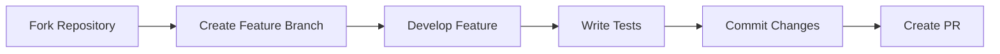

# Liu Theme - VitePress Blog Theme

[中文版](README.zh-CN.md) | [English](README.md)

[](https://github.com/liujunxiang0076/liu-theme/actions)
[](https://www.npmjs.com/package/vitepress)

## 🚀 Project Background
An open-source theme specifically designed for technical blogs, leveraging VitePress's rapid build capabilities and Vue 3's component-based development model to deliver an elegant reading experience with high customizability.

## 🎯 Design Goals
- Minimalist visual design
- Out-of-the-box blog features
- Comprehensive extensibility
- Continuous and stable version maintenance

[](LICENSE)
[](https://www.npmjs.com/package/vitepress)

Modern blog theme built on VitePress 1.x with integrated features including article categorization, Algolia search, PWA support, and RSS subscription.

## ✨ Core Features

### 🖌 Content Creation
- Enhanced Markdown (flowcharts, equations, custom containers)
- Automatic article categorization
- Update time tracking

### 🎛 System Features
- Multilingual support (Chinese/English toggle)
- Automatic RSS generation
- Progressive Web App (PWA)
- Page analytics integration

### ⚙ Development Experience
- Hot Module Replacement (HMR)
- Auto-registered components
- TypeScript support
- Visual theme debugger
- 📝 Enhanced Markdown (math equations, attribute extensions)
- 🔍 Algolia DocSearch integration
- 📱 Responsive layout
- 🎨 Customizable theme styles
- ⚡ Vite rapid build
- 📦 PWA offline support

## 🚀 Quick Start

### Prerequisites
- Node.js >= 20
- pnpm >= 8

### Installation
```bash
pnpm install
```

### Development Mode
```bash
pnpm dev
```

### Production Build
```bash
pnpm docs:build
```

### Local Preview
```bash
pnpm docs:preview
```

## 📂 Directory Structure
```
├── .vitepress/          # Theme configuration
│   ├── config.mts       # Theme config file
│   └── theme/           # Custom theme components
├── src/
│   ├── posts/           # Articles directory
│   └── pages/           # Standalone pages
├── public/              # Static resources
├── package.json
└── README.md
```

## 🛠 Advanced Configuration

### Theme Customization
```scss
// .vitepress/theme/style/_override.scss
$theme-colors: (
  light: (
    primary: #3eaf7c,
    code-bg: #f8f8f8
  ),
  dark: (
    primary: #4abf8a,
    code-bg: #2d2d2d
  )
);
```

### Extending Blog Features
1. Add comment system:
```ts
// config.mts
export default defineConfig({
  themeConfig: {
    comments: {
      service: 'giscus',
      repo: 'your-repo'
    }
  }
})
```

## 🛠 Tech Stack
- Core Framework: [VitePress 1.6](https://vitepress.dev)
- UI Framework: [Vue 3](https://vuejs.org)
- CSS Preprocessor: [Sass](https://sass-lang.com)
- Search Service: [Algolia DocSearch](https://docsearch.algolia.com)
- PWA Support: [vite-plugin-pwa](https://vite-pwa-org.netlify.app)

## 🎨 Theme Customization

### Modifying Theme Variables
Override default values in `.vitepress/theme/style/_variables.scss`:
```scss
// Primary colors
$primary-color: #3eaf7c;
$accent-color: #4abf8a;

// Layout dimensions
$content-width: 72rem;
$sidebar-width: 18rem;
```

### Adding Custom Components
1. Create Vue components in `.vitepress/theme/components`
2. Register globally in `.vitepress/theme/index.ts`:
```ts
import MyComponent from './components/MyComponent.vue'

export default {
  enhanceApp({ app }) {
    app.component('MyComponent', MyComponent)
  }
}
```

## 🔍 Search Configuration
1. Apply for [Algolia DocSearch](https://docsearch.algolia.com/apply/)
2. Add configuration in `.vitepress/config.mts`:
```ts
algolia: {
  appId: 'YOUR_APP_ID',
  apiKey: 'YOUR_API_KEY',
  indexName: 'YOUR_INDEX_NAME'
}
```

## 🤝 Contributing

### Development Workflow


### Quality Assurance
- Pass ESLint checks before committing
- Include Vitest unit tests for components
- Update Storybook for layout changes
- Maintain CHANGELOG.md for significant changes

### Commit Convention
- Follow [Conventional Commits](https://www.conventionalcommits.org)
- Example: `feat: add dark mode toggle component`

### Development Process
1. Create feature branch from `main`
2. Run lint checks:
```bash
pnpm lint
```
3. Update relevant unit tests
4. Reference related issues in PR

## 🚢 Deployment Guide
### Vercel Deployment
[](https://vercel.com/new/clone?repository-url=https://github.com/your-repo)

1. Install Vercel CLI:
```bash
pnpm add -g vercel
```
2. Deploy:
```bash
vercel deploy
```
