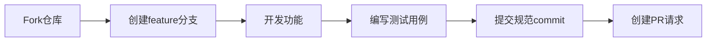

# Liu Theme - VitePress 博客主题

[](https://github.com/liujunxiang0076/liu-theme/actions)
[](https://www.npmjs.com/package/vitepress)

## 🚩 项目背景
专为技术博客打造的开源主题，基于VitePress的极速构建特性，结合Vue 3的组件化开发模式，旨在提供优雅的阅读体验和高度可定制性。

## 🎯 设计目标
- 极简主义视觉设计
- 开箱即用的博客功能
- 完善的扩展能力
- 持续稳定的版本维护

[](LICENSE)
[](https://www.npmjs.com/package/vitepress)

基于 VitePress 1.x 构建的现代化博客主题，集成文章分类、Algolia搜索、PWA支持、RSS订阅等特性。

## ✨ 核心特性

### 🖌 内容创作
- Markdown增强（流程图、公式、自定义容器）
- 文章分类自动聚合
- 更新时间自动追踪

### 🎛 系统功能
- 多语言支持（中英文切换）
- 自动生成RSS订阅
- 渐进式Web应用（PWA）
- 页面访问统计集成

### ⚙ 开发体验
- 热模块替换（HMR）
- 组件自动注册
- TypeScript类型支持
- 可视化主题调试工具
- 📝 Markdown 增强（数学公式、属性扩展）
- 🔍 Algolia 文档搜索集成
- 📱 响应式布局
- 🎨 可定制的主题样式
- ⚡ Vite 极速构建
- 📦 PWA 离线支持

## 🚀 快速开始

### 环境要求
- Node.js >= 20
- pnpm >= 8

### 安装
```bash
pnpm install
```

### 开发模式
```bash
pnpm dev
```

### 生产构建
```bash
pnpm docs:build
```

### 本地预览
```bash
pnpm docs:preview
```

## 📂 目录结构
```
├── .vitepress/          # 主题配置
│   ├── config.mts       # 主题配置文件
│   └── theme/           # 自定义主题组件
├── src/
│   ├── posts/           # 文章目录
│   └── pages/           # 独立页面
├── public/              # 静态资源
├── package.json
└── README.md
```

## 🛠 深度配置

### 主题样式定制
```scss
// .vitepress/theme/style/_override.scss
$theme-colors: (
  light: (
    primary: #3eaf7c,
    code-bg: #f8f8f8
  ),
  dark: (
    primary: #4abf8a,
    code-bg: #2d2d2d
  )
);
```

### 扩展博客功能
1. 添加评论系统：
```ts
// config.mts
export default defineConfig({
  themeConfig: {
    comments: {
      service: 'giscus',
      repo: 'your-repo'
    }
  }
})
```
1. 修改 `.vitepress/config.mts` 中的站点配置
2. 在 `src/posts` 目录下添加 Markdown 格式的文章
3. 自定义主题样式请修改 `theme/style` 中的 SCSS 文件

## 🛠 技术栈
- 核心框架：[VitePress 1.6](https://vitepress.dev)
- UI框架：[Vue 3](https://vuejs.org)
- 样式预处理器：[Sass](https://sass-lang.com)
- 搜索服务：[Algolia DocSearch](https://docsearch.algolia.com)
- PWA支持：[vite-plugin-pwa](https://vite-pwa-org.netlify.app)

## 🎨 主题定制
### 修改主题变量
在 `.vitepress/theme/style/_variables.scss` 中覆盖默认值：
```scss
// 主色配置
$primary-color: #3eaf7c;
$accent-color: #4abf8a;

// 布局尺寸
$content-width: 72rem;
$sidebar-width: 18rem;
```

### 添加自定义组件
1. 在 `.vitepress/theme/components` 创建 Vue 组件
2. 在 `.vitepress/theme/index.ts` 中全局注册：
```ts
import MyComponent from './components/MyComponent.vue'

export default {
  enhanceApp({ app }) {
    app.component('MyComponent', MyComponent)
  }
}
```

## 🔍 搜索配置
1. 申请 [Algolia DocSearch](https://docsearch.algolia.com/apply/)
2. 在 `.vitepress/config.mts` 中添加配置：
```ts
algolia: {
  appId: 'YOUR_APP_ID',
  apiKey: 'YOUR_API_KEY',
  indexName: 'YOUR_INDEX_NAME'
}
```

## 🤝 参与贡献

### 开发工作流


### 质量保障
- 提交前必须通过ESLint检查
- 组件需包含Vitest单元测试
- 布局修改需同步更新Storybook
- 重大变更需更新CHANGELOG.md
### 提交规范
- 提交信息遵循 [Conventional Commits](https://www.conventionalcommits.org) 规范
- 示例：`feat: 添加暗黑模式切换组件`

### 开发流程
1. 从 `main` 分支创建特性分支
2. 提交前运行格式检查：
```bash
pnpm lint
```
3. 更新对应组件的单元测试
4. 创建 Pull Request 时需关联相关 issue

## 🚢 部署指南
### Vercel 部署
[](https://vercel.com/new/clone?repository-url=https://github.com/your-repo)

1. 安装 Vercel CLI：
```bash
pnpm add -g vercel
```
2. 执行部署：
```bash
vercel deploy --prod
```

## 许可证
[MIT License](LICENSE) © 2023 LiuJunxiang
