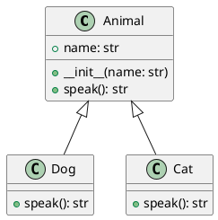

# 面向对象编程完全指南：从理论到实践

## 一、面向对象核心概念

### 1.1 类与对象



▲ 继承关系类图说明
```python
class Animal:
    def __init__(self, name):
        self.name = name

    def speak(self):
        pass

# 创建对象实例
dog = Animal("Buddy")
```

### 1.2 封装特性

```python
class Vector:
    def __init__(self, x, y):
        self.x = x
        self.y = y

    def __eq__(self, other):
        return self.x == other.x and self.y == other.y

    def __str__(self):
        return f"Vector({self.x}, {self.y})"

v1 = Vector(2, 3)
v2 = Vector(2, 3)
print(v1 == v2)  # True
print(str(v1))   # Vector(2, 3)
```
```python
class BankAccount:
    def __init__(self):
        self.__balance = 0  # 私有属性

    def deposit(self, amount):
        if amount > 0:
            self.__balance += amount

    def get_balance(self):
        return self.__balance
```

### 1.3 继承机制
```python
class Dog(Animal):
    def speak(self):
        return "汪汪！"

class Cat(Animal):
    def speak(self):
        return "喵～"
```

### 1.4 多态实现
```python
def animal_sound(animal):
    print(animal.speak())

animals = [Dog("阿黄"), Cat("小白")]
for a in animals:
    animal_sound(a)
```

## 二、SOLID设计原则

### 2.5 依赖倒置原则（DIP）实战
```python
from abc import ABC, abstractmethod

class NotificationService(ABC):
    @abstractmethod
    def send(message: str): ...

class EmailService(NotificationService):
    def send(self, message):
        print(f"发送邮件：{message}")

class SMSService(NotificationService):
    def send(self, message):
        print(f"发送短信：{message}")

class ReportGenerator:
    def __init__(self, service: NotificationService):
        self.service = service

    def generate(self):
        self.service.send("月度报告已生成")
```

### 2.1 单一职责原则（SRP）
```python
# 违反SRP的类
class UserManager:
    def __init__(self, user):
        self.user = user

    def save_to_db(self):
        # 数据库操作
    
    def send_welcome_email(self):
        # 发送邮件

# 符合SRP的改造
class UserSaver:
    def save_to_db(self, user):
        # 数据库操作

class EmailSender:
    def send_welcome(self, user):
        # 发送邮件
```

### 2.2 开闭原则（OCP）
```python
class Shape:
    def area(self):
        pass

class Rectangle(Shape):
    def __init__(self, width, height):
        self.width = width
        self.height = height

    def area(self):
        return self.width * self.height

class Circle(Shape):
    def __init__(self, radius):
        self.radius = radius

    def area(self):
        return 3.14 * self.radius ** 2
```

## 三、设计模式实战

### 3.1 工厂模式对比

| 模式类型        | 适用场景                          | 优点                    | 缺点                |
|----------------|---------------------------------|------------------------|--------------------|
| 简单工厂模式    | 对象创建逻辑简单                 | 封装创建过程，客户端解耦 | 违反开闭原则        |
| 抽象工厂模式    | 需要创建产品族                   | 保证产品兼容性          | 扩展新产品困难      |

### 3.2 Mixin模式应用
```python
class JSONSerializableMixin:
    def to_json(self):
        import json
        return json.dumps(self.__dict__)

class XMLSerializableMixin:
    def to_xml(self):
        from xml.etree.ElementTree import Element, tostring
        elem = Element(self.__class__.__name__)
        for k, v in self.__dict__.items():
            child = Element(k)
            child.text = str(v)
            elem.append(child)
        return tostring(elem)

class User(JSONSerializableMixin, XMLSerializableMixin):
    def __init__(self, name, age):
        self.name = name
        self.age = age

user = User("张三", 30)
print(user.to_json())
print(user.to_xml())
```
